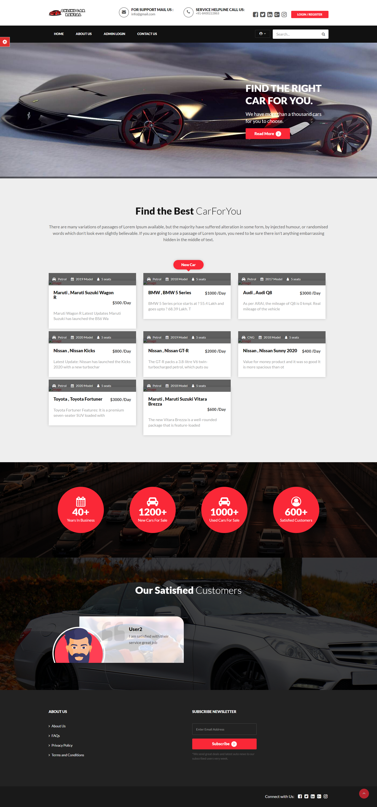

# PSG_Car_Rental_Management_System

## Follow the following instructions to run project:

1. Download and install [xampp-windows-x64-8.1.12-0-VS16-installer.exe](https://www.apachefriends.org/) or You can also download another version like wamp server.
2. Clone this Repository: `git clone https://github.com/piyushsinghgaur/PSG_Car_Rental`
3. Move the Files to the **htdocs** folder of the xampp.
4. Navigate to localhost/phpmyadmin and create a new database called **carrental**.
5. When it has been created, navigate to import tab. Then select the sql file in this folder. Select go.
6. You can navigaate to the system via localhost/carrental.
7. Username and password are provided in **READ ME FIRST !!!!.txt**.

### **Screenshot of the project** :arrow_down:

